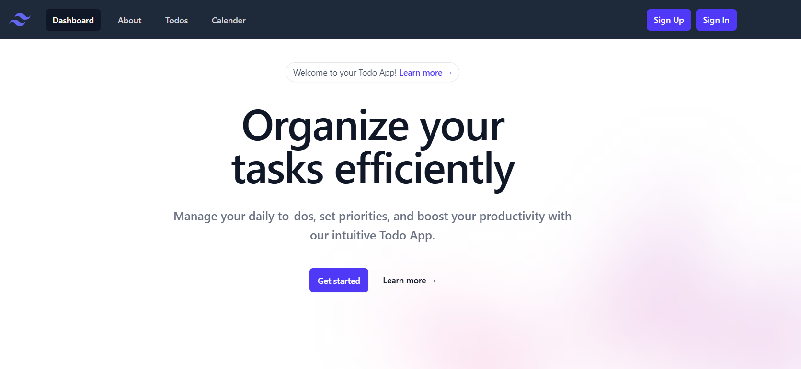

## Connect with Me

Follow me on social media:

[](#)
[](#)
[](#)
[](#)
[](#)

# Todo App with Calendar Events

## Project Overview
This is a frontend React application for a Todo App integrated with calendar events. The app is built using Vite and React, styled with Tailwind CSS, and uses React Router DOM for navigation. It supports user authentication (signup and login), todo management (add, update, delete), and calendar event management with synchronized views using `react-calendar` and `react-big-calendar`.


## Features
- User Signup and Login with form validation using React Hook Form.
- Todo management:
  - Add, update, delete todos with title and body.
  - Todos are saved locally and synced with backend if user is logged in.
  - Notifications on todo actions using React Toastify.
- Calendar management:
  - Two synchronized calendar views using `react-calendar` and `react-big-calendar`.
  - Add, edit, delete events with details like title, description, date, start/end time, category, and color.
  - Events are saved locally and synced with backend if user is logged in.
- Navigation with React Router DOM using `<NavLink>` for smooth transitions.
- Responsive UI styled with Tailwind CSS and additional components from `@heroicons/react` and `@headlessui/react`.
- User state management with Redux Toolkit.

## Tech Stack
- React (with Vite)
- Tailwind CSS
- React Router DOM
- React Hook Form
- React Icons
- React Toastify
- Redux Toolkit
- react-calendar
- react-big-calendar
- Additional Tailwind dependencies: `@heroicons/react`, `@headlessui/react`
## Screenshot



<div align="center">

## [](https://todo-6h57rk03s-ankitbhagat2062s-projects.vercel.app)

</div>

## Getting Started

### Prerequisites
- Node.js (v14 or above)
- npm (comes with Node.js)

### Installation

1. Clone the repository:
```bash
git clone <https://github.com/Ankitbhagat2062/Todo-App.git>
cd <Todo App>
```

2. Install dependencies:
```bash
npm install
npm install @heroicons/react@^1.0.6 @headlessui/react@^1.7.14
```

3. Run the development server:
```bash
npm run dev
```

4. Open your browser and navigate to the URL shown in the terminal (usually `http://localhost:5173`).

## Usage
- Use the navigation bar to go to Signup, Login, Todo, Calendar, and About pages.
- Signup with email, username, and password (password must be 8+ characters with uppercase, lowercase, number, and special character).
- Login with email and password.
- Manage your todos: add new todos, update existing ones, or delete them.
- Manage calendar events: add events with details, edit or delete them.
- Notifications will appear for actions like adding, updating, or deleting todos and events.

## Cloning the Repository
To clone this repository, run the following command in your terminal:
```bash
git clone <https://github.com/Ankitbhagat2062/Todo-App.git>
```


## Additional Notes
- The app integrates with a backend server for user authentication and data persistence. Ensure the backend is running and accessible.
- User ID is stored in localStorage after login/signup to sync todos and events with the backend.
- Tailwind CSS components used in this project require additional dependencies (`@heroicons/react` and `@headlessui/react`), so make sure to install them as shown above.

---

Thank you for using the Todo App! If you encounter any issues or have questions, feel free to open an issue or contact the maintainer.
